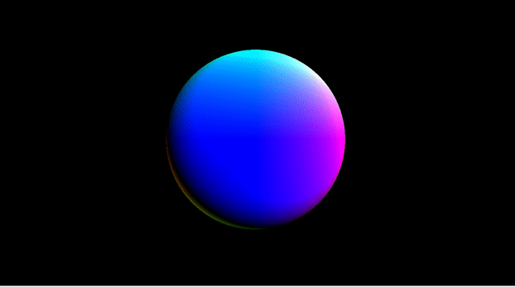

# Example 4k intro for 64-bit Linux

This is a 4k intro skeleton, originally from [dnload by Faemiyah](http://faemiyah.fi/demoscene/dnload).

The binary is 1097 bytes when building it here. It uses a small shallescript header, where the ELF file is extracted to /tmp before being run. This is a permitted technique for most demoscene intro/4k compos. Extracting the code into memory and executing it there might be a better tecnique.

---

This project can be compiled with [shrinky](https://github.com/xyproto/shrinky) (available in [AUR](https://aur.archlinux.org/packages/shrinky/)).

    shrinky main.cpp

---

The intro itself is also available in [AUR](https://aur.archlinux.org/packages/shrinky-intro/).

---

* Impressive work by Faemiyah!
* Now easier to experiment with on Arch Linux.
